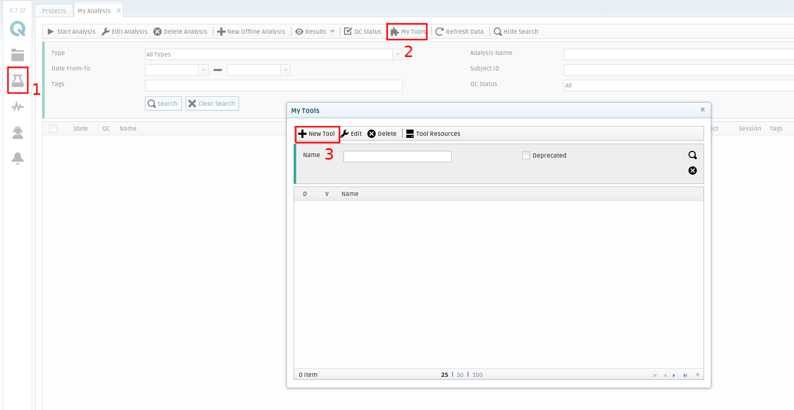
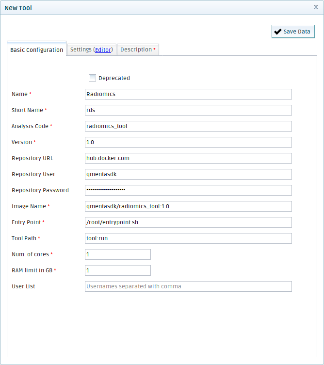
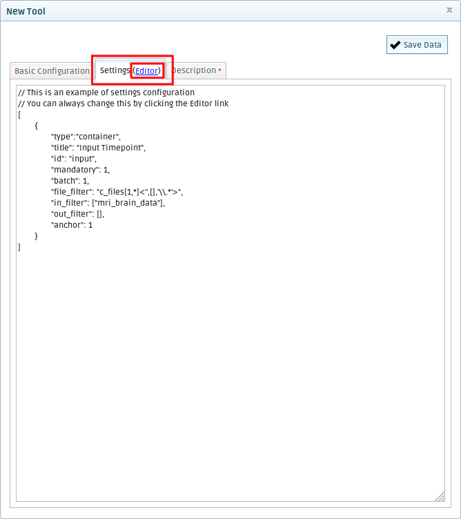
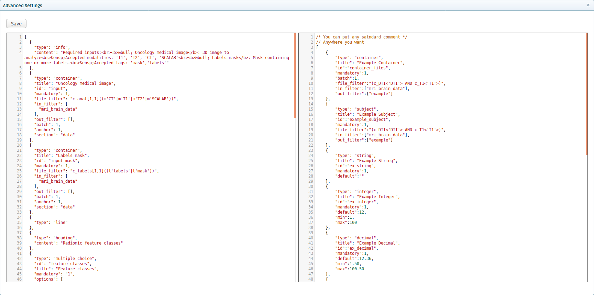
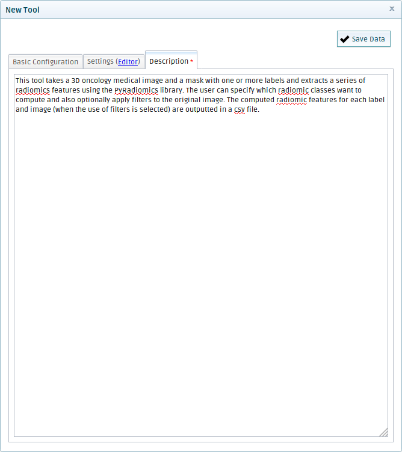
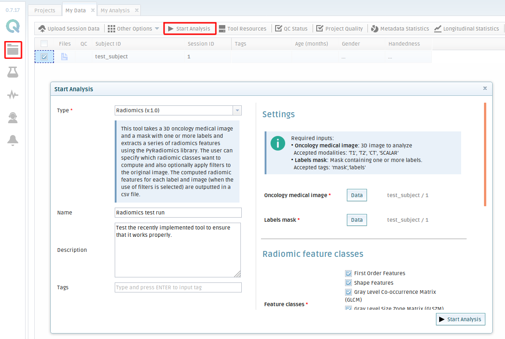
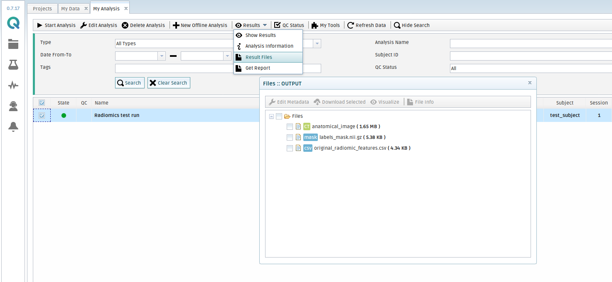

# QMENTA SDK TOOL TUTORIAL


---

## Introduction

The main purpose of this repository is to provide a guide explaining how to deploy a custom based on the QMENTA SDK into [QMENTA platform](https://client.qmenta.com/#/login) following the procedure step-by-step.

To get more detailed and technical information about the QMENTA SDK and its capabilities, please refer to it's [documentation](https://docs.qmenta.com/sdk/).

As a case study, we will implement a tool that takes as inputs an oncology medical image and a segmentation mask with one or more labels, and then it uses the [Pyradiomics library](https://pyradiomics.readthedocs.io/en/latest/index.html) to extract radiomic features from the data. 
The tool will allow the user to select which classes of radiomic features wants to compute and also select.

The deployment of a tool has three principal steps:
* Write the main script
* Build a docker container with the appropriate environment for the tool to run.
* Add the tool to QMENTA platform. 

---

## Step 1: Write the main script

The first step consists of writing the python code that will carry out the desired processing of the input files. In this repository you'll find the implemented script in the file named [*tool.py*](https://github.com/qmentasdk/qmenta-sdk-tool-tutorial/blob/master/tool.py). The tool is commented in detail so it's easy to follow up.

The script uses methods of the AnalysisContext class from the QMENTA SDK to interact with the platform and perform the following actions:

* Download the input data to the container using `context.get_files()`
* Retrieve the settings defined for the analysis using `context.get_settings()`
* Set the progress status to monitor the analysis from the platform using `context.set_progress()`
* Upload the result files from the container to the platform using `context.upload_file()`

## Step 2: Build the docker container where the tool will run

To follow through this step two requirements must be fulfilled: have Docker installed ([how to](https://docs.docker.com/install/)) and have a docker registry, we recommend using [docker hub](https://hub.docker.com/) for its integration with Docker when uploading images.


In this example we build the docker container using a Dockerfile. The one we used is included in this repository:

```Dockerfile
# Start from a QMENTA public container containing python 3, qmenta-sdk library and a configured entrypoint.
FROM qmentasdk/minimal:latest

#Copy the tool script to the container.
COPY tool.py /root/tool.py

# Install all the required libraries and tools (in this case only python libraries are needed).
RUN pip install SimpleITK nibabel numpy pandas
RUN python -m pip install pyradiomics 
```

To build the container, we open a terminal window and run the following commands:

* Acces the folder where the Dockerfile and the _tool.py_ files are stored

   `>> cd /home/guillem/dev/qmenta-sdk-tool-tutorial`
  
* Build the container from the Dokerfile

    `>> docker build -t qmentasdk/radiomics_tool:1.0 .`
    
    Where **qmentasdk** is the name of the docker registry, **radiomics_tool** the name of the repository (tool) and **1.0** the tag (tool version). 
 
* Login to the docker hub registry
    
    `>> docker login`
    
    This will ask for the username and the password.
* Save the container in the docker registry
    
    `docker push qmentasdk/radiomics_tool:1.0`
 
More information about working with docker containers in the [QMENTA skd documentation](https://docs.qmenta.com/sdk/develop_images.html#using-a-dockerfile).

A list of QMENTA's public docker containers can be found at the [qmentasdk docker registry](https://hub.docker.com/u/qmentasdk).

## Step 3: Add the Tool to the platform

> **Tip**: Prior to this step, we recommend testing that the container was properly build by locally running the tool. To learn how to do so, check the [Testing tools on your computer](https://docs.qmenta.com/sdk/testing.html) section in the QMENTA sdk documentation.

To follow this step you will need to have an account in [QMENTA platform](https://client.qmenta.com/#/login) and have the ability to deploy tools enabled.

* Log in to the platform and acces the **My Analysis** menu. Then, click on **My tools** and select **New tool**.<br/>

 <br/>

* Fill all the fields with the information about your tool.<br/>



* Field description
    * **Name**: the full name of your tool.
    * **Short Name**: a short version of the name of the tool.
    * **Analysis Code**: the tool ID (without spaces or special characters).
    * **Version**: your version identifier.
    * **Repository URL**: the registry where your image is stored (hub.docker.com)
    * **Repository User**: username of the registry.
    * **Repository Password**: your registry password.
    * **Image Name**: the full image name (username/tool_name:version).
    * **Entry Point**: the sequence of commands run at start-up. See Extending the Entry Point for more information.
    * **Tool Path**: the function name and method of the tool python script (tool:run).
    * **Num. of cores**: the number of CPU cores allocated to the tool.
    * **RAM limit in GB**: the amount of memory allocated to the tool.
    * **User List (optional**): the usernames of the users you want to share the tool with.


* Add settings
    * Go to the **settings** tab and click on _Editor_.<br/>
    
     <br/>
    
    * Use the examples on the right screen to define the settings that your tool needs. This includes input containers and parameters of the tool. In this repository you can take a look at the settings implemented in the [_settings.json_](https://github.com/qmentasdk/qmenta-sdk-tool-tutorial/blob/master/settings.json) file. <br/>
    
    
    
    
* Add a description
    * This texts is going to be displayed when running the tool from the platform. <br/>

    
    
---

## Running the tool

After the completion of the three steps the tool is ready to be run from the platform.

To do so, you can go to **My Data** in the platform, select a subject that contains the necessary files to run the tool (properly tagged) and click on **Start Analysis**. Then select your tool, choose the parameters you want it to run with and optionally add a name and a description to the analysis. Click on **Start Analysis** when the configuration is ready.
 
 
  <br/>

 The platform will run the analysis and send an email whenever it finishes. Then, you can retrieve the results by going to **My Analysis**, selecting the finished analysis, and then click on **Result files** inside the Results tab.
 
  